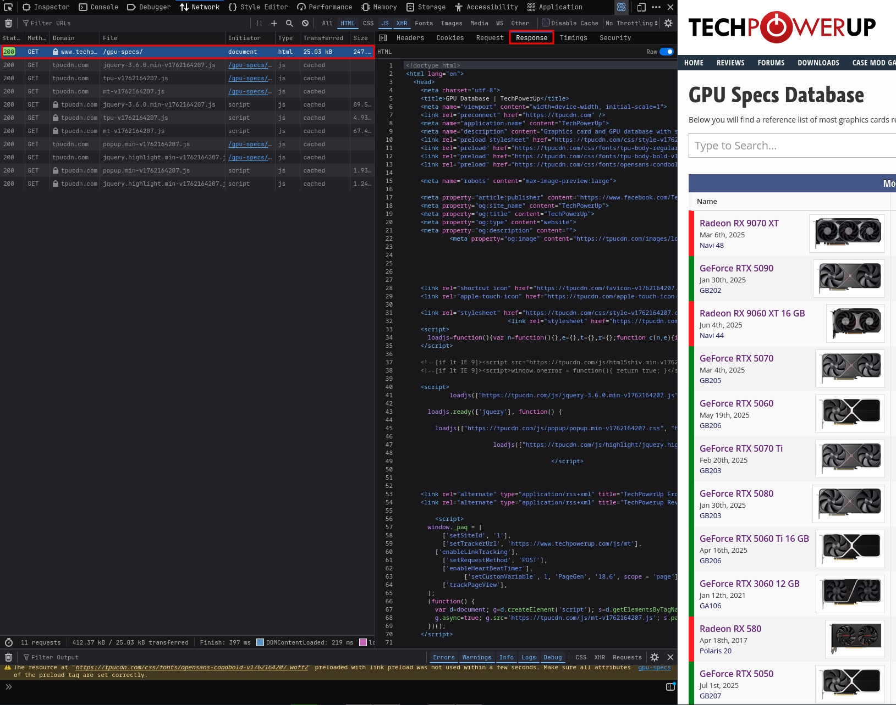
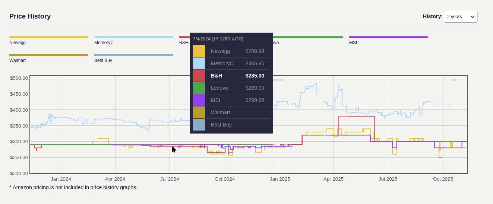
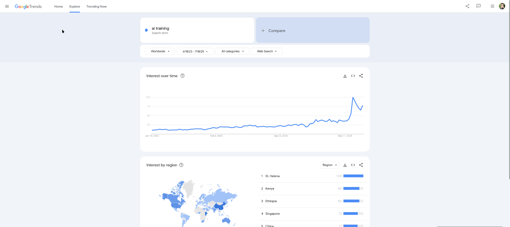

## Uvod
Ovaj dokument u kratkim crtama opisuje proces prikupljanja podataka za projekat iz predmeta SIAP: "Analiza uticaja razvoja tehnologija veštačke inteligencije i kriptovaluta na cene grafičkih karti". Ukratko, ciljevi projekta su:
1. Pronaći karakteristike grafičkih karti koje najviše doprinose performansama *mineovanja* kriptovaluta (konkretno, kriptovaluta Monero i Ethereum Classic)
2. Pronaći karakteristike grafičkih karti koje najviše doprinose performansama treniranja AI modela
3. Predikcija cene grafičke karte u odnosu na cene kriptovaluta i trenda AI treniranja

##  Razmatranje potrebnih podataka
- Osnovu ovog projekta čine analize koje figurišu sa grafičkim kartama, dakle potreban je *dataset* grafičkih karti sa njihovim detaljnim specifikacijama.
- Potrebna je referenca na osnovu koje se može zaključiti koje grafičke karte imaju dobre performanse za kopanje svake od navedenih kriptovaluta. Izabrane su dve kriptovalute čiji se algoritmi razlikuju u karateristikama koje zahtevaju (*core-intensive algoritmi i memory intensive algoritmi*)
- Slično kao i za kriptovalute, potrebna je referenca na osnovu koje se može zaključiti koje grafičke karte imaju dobre performanse u AI trening procesima.
- Za predikciju cene su potrebni time-series podaci grafičkih karti, navedenih kriptovaluta i trenda AI treniranja. Ordeđen je period od 2 godine.

## Dataset 1: Grafičke karte i njihove specifikacije
- Za svaki *dataset* prvi korak je pretraga interneta za predefinisanim *dataset*-ovima. Na sajtovima kao što su [Kaggle](https://kaggle.com), [Hugging Face](https://huggingface.co) i sličnim, moguće je naći skupove podataka koje su drugi ljudi koristili za treniranje svojih modela.  
- Ovakvi postojeći *dataset*-ovi nisu zadovoljavali kriterijume jer su podaci bili ili zastareli (grafičke karte do 2022. recimo, što je 2-3 godine grafičkih karti koje nedostaju, i to u potencijalno bitnom periodu zbog razvoja AI tehnologija) ili jer su podaci bili većinski nepotpuni.
- Sledeći korak je nastaviti potregu za *datasetom* na internetu, ali ne u struktuiranoj formi - tech blogovi, forumi i slično.
- Nakon što se nađe adekvatan sajt, u ovom slučaju je to [TechPowerUp](https://www.techpowerup.com/gpu-specs/), potrebno je proveriti, kako sajt dobavlja podatke. Ako pogledamo u *Network* tab *debug* konzole u pretraživaču možemo da vidimo sledeće:

- Konkretno, ovaj sajt koristi *Server-side-rendering* i vraća kompletno generisanu HTML stranicu sa podacima. Ovo otežava posao jer se ovako renderovane stranice moraju dodatno parsirati i obrađivati kako bi se podaci prikupili. Kada bi sajt koristio *Client-side-rendering* najverovatnije bi podatke o GPU-ovima vratio u nekom struktuiranom formatu (npr: lista *JSON* objekata) i time značajno olakšao posao.
- Iako je *scrape*-ovanje podataka moguće sa bilo kojim programskim jezikom koji ima podršku za slanje *HTTP* zahteva, *Python* poseduje dobro razvijen ekosistem biblioteka za ove potrebe koje olakšavaju posao.
- Pošto se detalji svake grafičke karte nalaze na zasebnoj stranici na koju se ulazi preko linka, da bi se smanjio broj zahteva poslatih ka serveru, u ovom konkretnom primeru prvo je *scrape*-ovana lista svih karti sa linkovima ka njihovim stranicama sa detaljima, a nakon toga se iteriranjem kroz tu listu pristupalo stranicama sa detaljima.
- Dodatni problem koji se nameće kod popularnih web sajtova je taj što oni uglavnom imaju neku vrstu zaštite od *scrape*-ovanja. Konkretno *TechPowerUp* ima neku vrstu *rate-limit* zaštite koja ograničava broj zahteva koje server može da obradi sa jedne *IP* adrese. Ovaj vidi zaštite nije preterano težak za zaobići, više je tu da učini posao napornim.
- Najjednostavniji način da se ovaj problem reši je ubaciti vremenski *delay* između zahteva tako da se ne dostigne ograničenje koje je postavljeno. Ovo je doduše eksperimentalno, jer je nemoguće znati koje je ograničenje u napred, tako da barem jednom korisnik mora da bude limitiran - što je u ovom slučaju oko 1 dan zabrane pristupa na sajt sa konkretne *IP* adrese.
- Drugi, sofisticiraniji način je koristiti *IP proxy* servere. Ovi serveri poslate zahteve rutiraju preko jedne od svojih *IP* adresa i time maskiraju originalnu adresu. problem sa ovim rešenjem je što može da bude skupo jer besplatni *proxy* serveri uglavnom ili jako loše rade posao ili ga ne rade uopšte. O sigurnosti da ne pričamo.
- Način na koji je *rate-limit* na ovom sajtu rešen na primeru našeg projekta je automatizacija i *deploy*-ovanje virtuelnih mašina na *AWS cloud* koje bi sve radile deo posla dok ih sajt ne blokira. Ovo je uštedelo mnogo vremena, a sa *AWS Free Tier* opcijama posao je završen bez dodatnih torškova.

## Dataset 2 i 3: Grafičke karte pogodne za majnovanje kriptovaluta Monero i Ethereum Classic
- Ovaj *dataset* takođe nije mogao da se nađe predefinisan, te je kreiran *scrape*-ovanjem podataka sa sajta [WhatToMine](https://whattomine.com/).
- Nije bilo poteškoća prilikom *scrape*-ovanja podataka sa ovog sajta, jer sajt definiše najboljih 20 grafičkih karti za konkretan algoritam
- Podaci za druge grafičke karte su naknadno izvedene na osnovu specifikacija iz *dataseta 1* i reference iz ovih *datasetova*

## Dataset 4: Grafičke karte pogodne za AI trening poslove
- Nije pronađen adekvatan predefinisan *dataset*
- Na sajtu [LambdaLabs](https://lambda.ai/gpu-benchmarks) je dat grafik koji kombinuje više *benchmarka* u jedinstvanu vrednost nazvanu *speedup* koja predstavlja koliko su performanse neke karte relativno bolje u odnosu na definisan *baseline*
- Nije bilo poteškoća prilikom *scrape*-ovanja podataka sa ovog sajta
- Podaci za druge grafičke karte su naknadno izvedene na osnovu specifikacija iz *dataseta 1* i reference iz ovog *dataseta*

## Dataset 5: Cene grafičkih karti u periodu od ~2 godine

- Nije pronađen adekvatan *dataset*
- Jako teški podaci za pronaći, generalno istorijske cene nije nešto što se prikazuje na otvorenom
- Sajt [PCPartPicker](https://pcpartpicker.com/products/video-card/) koji služi za kreiranja konfiguracija za desktop računare na individualnim komponentama može da prikaže cenu različitih prodavaca (na teritoriji SAD)

- Više problema:
	- PCPartPicker koristi CloudFlare koji ima jednu od najboljih bot zaštita u industriji
	- Podaci na grafiku se prikazuju na *hover* preko grafika, može biti teško skriptovati
 
- Anti-bot zaštite su jako sofisticirane i prate takoreći korisnikovo ponašanje unutar browsera. Postoje biblioteke i razne metode koje povećavaju šansu da bot/skripta prođu nedetektovani, ali ova tehnologija je bolje iz dana u dan, tako da nešto što radi danas ne mora da radi sutra. Posle nekoliko dana neuspešnog zaobilaženja ove zaštite, odlučeno je da se primeni hibridna metoda ili polu-automatsko *scrape*-ovanje.
- Posle detaljnog istraživanje HTTP zahteva i podataka koje PCPartPicker dobija kada se učita stranica o detaljima grafičke karte utvrđeno je da su podaci o cenama enkodovani unutar *script* taga unutar same *HTML* stranice i da je moguće parsirati ih ukoliko je moguće preuzeti *HTML* stranicu. 
- Kreiran je program koji osluškuje registrovani direktorijum i registruje događaje **kreiranja HTML fajla**. Kada se novi *HTML* fajl napravi u datom direktorijumu program ga automatski parsira i iz njega izvlači potrebne podatke o cenama, formatira ih i čuva u CSV fajl. Ostatak posla morao je biti odrađen manuelno, dakle korisnik koji *scrape*-uje sajt mora da ručno navigira kroz sajt da nađe željenu grafičku kartu kako bi mogao da rešava *CloudFlare chanllenges*  ukoliko se oni pojave. Kada korisnik dođe na željenu stranicu potrebno je da prečicom *CTRL+S* sačuva HTML stranicu u dati direktorijum čime će okinuti automatsko parsiranje i kreiranje *dataseta* sa cenama za datu grafičku kartu.

## Dataset 6: Trend AI treniranja u periodu od ~2 godine
- Ovaj trend je moguće aproksimirati na različite načine kao što su na primer Sentiment Analysis sa popularnih sajtova za kreiranje sadržaja kao što je Reddit ili Youtube. Odlučeno je da se uzme jednostavnija aproksimacija koja ne gleda da li se term "AI training" spominje u pozitivnom ili negativnom smislu, nego samo koliko puta se pojavljuje kao Google search term na svetskom nivou za određeni period.

- Ovi podaci se mogu preuzeti i jedino je potrebno interpolirati ih jer je jedinica nad kojom [Google Trends](https://trends.google.com/trends/explore?date=2023-06-18%202025-07-18&q=ai%20training&hl=en-US) radi jedna nedelja.

## Dataset 7 i 8: Cene kriptovaluta Monero i Ethereum Classic u periodu od ~2 godine
- Kao i za ostale *dataset*-ove, problem predefinisanih setova ove vrste jer što brzo zastare. Srećom postoji mnogo sajtova koji nude podatke o istorijskim cenama bilo koje kriptovalute kroz njihov API. Na žalost dosta ovih sajtova traži neki skuplji paket za ovu uslugu, pa je bilo potrebno malo više vremena da se nađe sajt koji nude ovakve podatke besplatno kao što je [CoinCodex](https://coincodex.com/crypto/)
- Podaci mogu da se preuzmu bez *scrape*ovanja